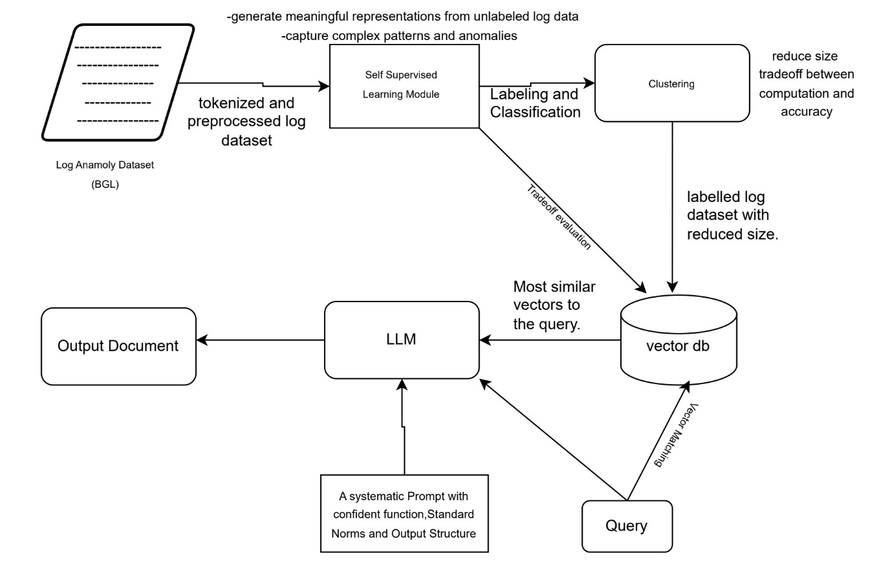

# Self-Supervised Learning and RAG for Query Optimization in Log Analysis

This project implements two synergistic pipelines designed for intelligent log query optimization and forensic analysis in cybersecurity environments. The first leverages **self-supervised learning** for latent representation of log data, while the second uses **Retrieval-Augmented Generation (RAG)** for context-aware response generation.

---

## Overview

The goal is to combine unsupervised feature learning and advanced retrieval techniques with generative models to enable:
- Efficient query optimization
- High-precision log retrieval
- Automated forensic reporting

---

## Pipeline 1: Self-Supervised Learning for Query Optimization

This pipeline extracts **latent embeddings** from raw, unlabeled logs (e.g., BGL dataset) using self-supervised deep learning.

### 1. Data Ingestion and Preprocessing
- Normalize and tokenize raw logs.
- Transform data for model input (e.g., sliding windows, sequences).

### 2. Unsupervised Representation Learning
- Train a **Transformer** or **CNN-based** model using:
  - Masked token prediction
  - Contrastive learning
- Learns **contextual embeddings** without labeled data.

### 3. Latent Space Formation
- Embeddings are projected into a **compact latent space**.
- Enables:
  - Semantic grouping
  - Log clustering
  - Noise reduction

###  4. Query-Specific Fine-Tuning
- Fine-tune on query phrases or target events.
- Map queries to latent features for:
  - Faster search
  - Higher precision
  - Semantic similarity retrieval

---

## 📚 Pipeline 2: Retrieval-Augmented Generation (RAG)

The RAG model improves **log intelligence** by combining retrieval from a vector database with generative capabilities of LLMs.

### 1. Query Processing and Embedding Generation
- Encode user query using a **pre-trained transformer**.
- Output: dense query embedding in semantic vector space.

### 2. Document Retrieval via Vector Database
- Use **vector similarity search** (e.g., FAISS, Milvus).
- Retrieve logs, reports, and documents from the indexed corpus.

### 3. Contextual Augmentation
- Augment query with **retrieved documents**.
- Provide **domain-specific context** to the language model.

### 4. Generative Module (LLM Integration)
- Use a **large language model** (e.g., GPT, T5, BERT-GEN) to generate:
  - Detailed reports
  - Anomaly explanations
  - Actionable insights

### 5. Post-Processing
- Perform:
  - Format normalization
  - Coherence validation
  - Confidence scoring

---

## ⚙️ Key Advantages

| Feature                     | Self-Supervised Model | RAG Model |
|----------------------------|------------------------|-----------|
| Label-Free Training        | ✅                     | —         |
| Latent Log Understanding   | ✅                     | —         |
| Semantic Retrieval         | ✅                     | ✅        |
| Context-Aware Generation   | —                      | ✅        |
| Forensic Reporting         | —                      | ✅        |

---

## Use Cases

- Cybersecurity threat detection
- Log anomaly clustering
- Automated forensic response
- Enterprise IT monitoring

---

## Technologies

- PyTorch / TensorFlow
- Hugging Face Transformers
- FAISS / Milvus / Weaviate
- Vector databases (Pinecone, Qdrant)
- LLMs (OpenAI, Cohere, Google PaLM, etc.)

## Future Work

- Joint fine-tuning of retrieval and generation modules
- Reinforcement learning for LLM response optimization
- Integration with real-time monitoring systems

---

## Contributors

Feel free to fork, extend, and contribute. PRs are welcome!
